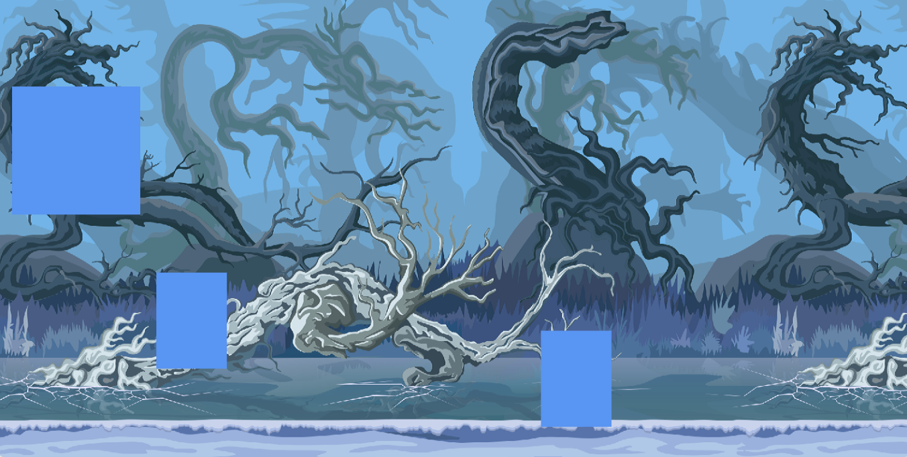

# xGaMe

Repository for Game Development in JavaScript

## Summary

This repository contains the development of a 2D game as part of a study on the video game creation process.
The idea is to explore essential concepts in the development of interactive games, such as the use of a game engine, HTML, CSS and JavaScript.

### Important Dates

* Game release - 10/01/2025

### Commits

- **1 - First stage of the game**: Initial game structure.

### Game Images

---